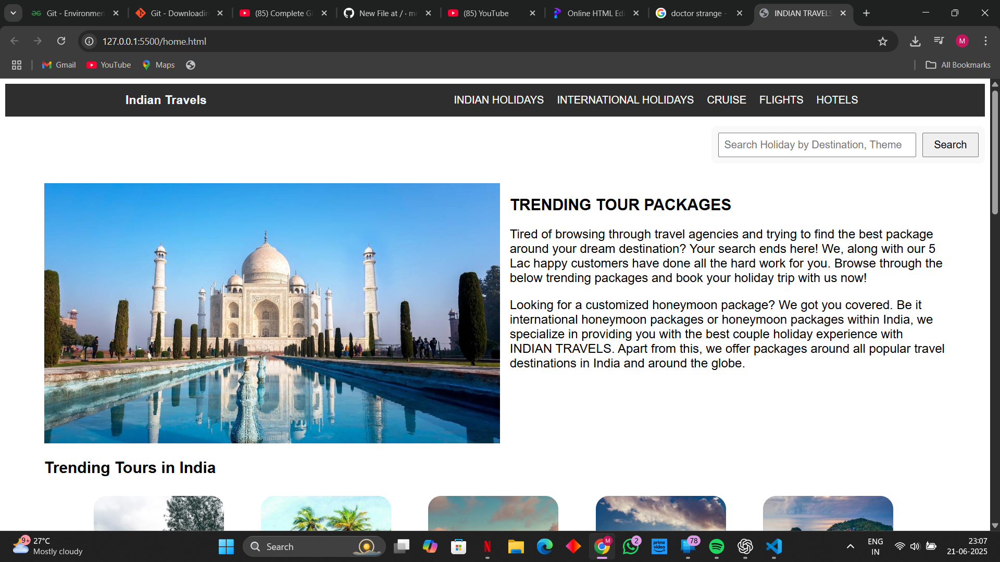
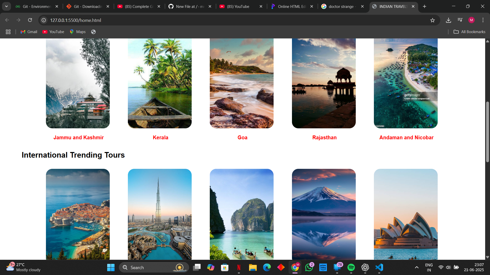
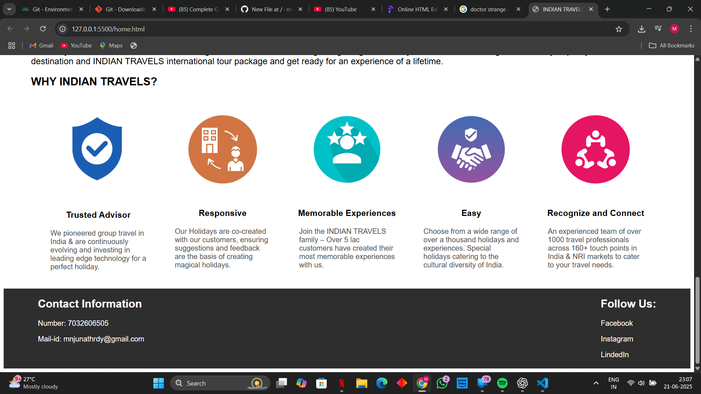
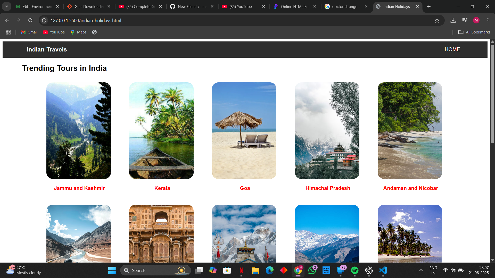
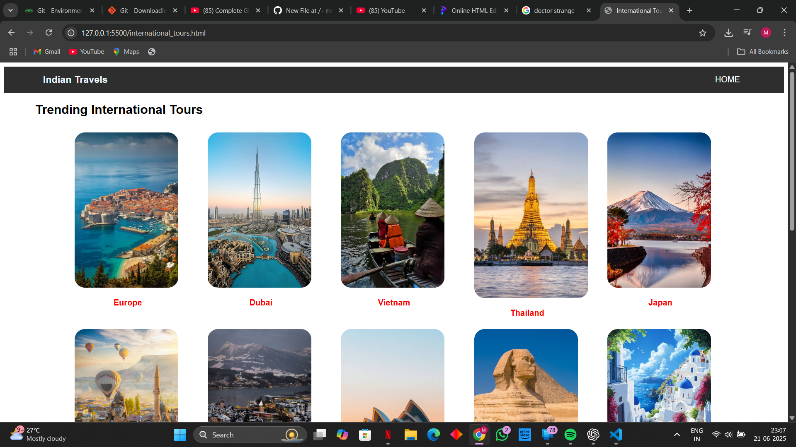

# 🌍 Travel Website Using HTML and CSS

A clean, responsive travel website built entirely using **HTML** and **CSS**. This project is designed to showcase the front-end development of a modern travel agency website with sections for destinations, packages, and an about area.

---

## 📖 Project Overview

This project demonstrates the design and development of a fully static travel-themed website. It's suitable for showcasing destinations, promoting tour packages, and giving potential travelers an overview of services offered. The website is mobile-friendly and can serve as a great starting point for adding more interactivity in the future.

---

## 🛠️ Tech Stack

- **HTML5** – Structure and semantic content  
- **CSS3** – Styling, layout, animations, and responsive design  
- **No JavaScript** – This is a purely static front-end project

---

## 💡 Features

- 📱 Responsive design for all screen sizes  
- 🖼️ Hero section with call-to-action  
- 🗺️ Popular destinations section  
- 🎁 Travel packages listing  
- 👤 About us and contact sections  
- 🦶 Footer with useful links and social media placeholders

---

## 📸 Screenshots

Here are some previews of the Travel Website in action:

## 📂 Folder Structure

